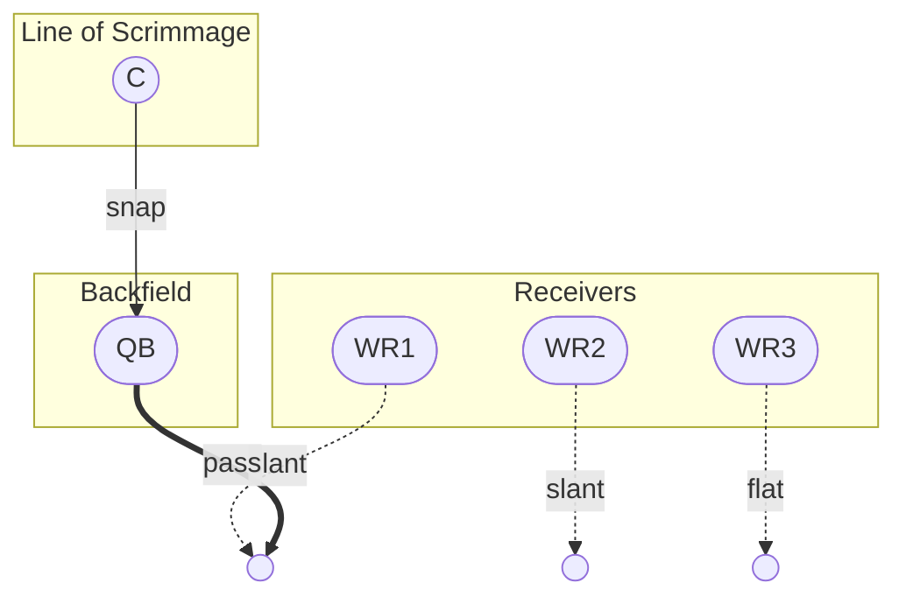
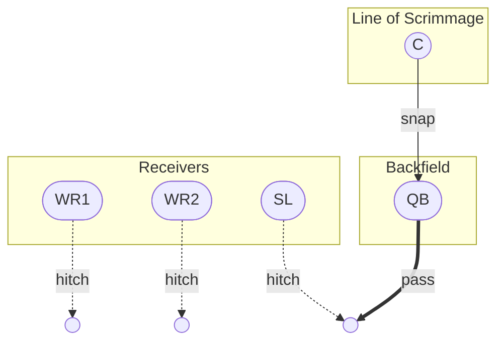

# ffp – Flag Football Plays

Generate [Mermaid](https://mermaid.js.org/) flowcharts for flag football plays.

## Installation

```bash
npm install
```

## Usage

### CLI

```bash
# List available plays
node src/index.js

# Generate a Mermaid chart for a specific play
node src/index.js slant
node src/index.js go-route
node src/index.js hitch
node src/index.js post
node src/index.js qb-scramble
node src/index.js corner-route
node src/index.js screen-pass

# Generate charts for all plays
node src/index.js --all
```

### API

```javascript
const { PlayDiagram } = require('./src/PlayDiagram');
const { slant } = require('./src/plays/index');

// Generate raw Mermaid chart syntax
const diagram = new PlayDiagram(slant);
console.log(diagram.generate());

// Generate a Markdown block with heading, description, and chart
console.log(diagram.toMarkdown());

// Define your own play
const myPlay = {
  name: 'Four Verticals',
  description: 'All four receivers run deep go routes.',
  players: [
    { id: 'C',   label: 'C',   role: 'center' },
    { id: 'QB',  label: 'QB',  role: 'quarterback' },
    { id: 'WR1', label: 'WR1', role: 'wide_receiver', side: 'left' },
    { id: 'WR2', label: 'WR2', role: 'wide_receiver', side: 'right' },
    { id: 'SL1', label: 'SL1', role: 'slot', side: 'slot_left' },
    { id: 'SL2', label: 'SL2', role: 'slot', side: 'slot_right' },
  ],
  actions: [
    { from: 'C',   to: 'QB',   type: 'snap' },
    { from: 'WR1', to: 'WR1_T', type: 'go' },
    { from: 'WR2', to: 'WR2_T', type: 'go' },
    { from: 'SL1', to: 'SL1_T', type: 'go' },
    { from: 'SL2', to: 'SL2_T', type: 'go' },
    { from: 'QB',  to: 'SL2_T', type: 'pass', primary: true },
  ],
};

const myDiagram = new PlayDiagram(myPlay);
console.log(myDiagram.toMarkdown());
```

## Play Schema

| Field | Type | Description |
|-------|------|-------------|
| `name` | `string` | Name of the play |
| `description` | `string` (optional) | Short description |
| `players` | `Player[]` | List of players on the field |
| `actions` | `Action[]` | Snap, routes, and ball movement |

### Player

| Field | Type | Description |
|-------|------|-------------|
| `id` | `string` | Unique identifier used in actions |
| `label` | `string` (optional) | Display label (defaults to `id`) |
| `role` | `string` | `center`, `quarterback`, `wide_receiver`, `running_back`, `tight_end`, or `slot` |
| `side` | `string` (optional) | `left`, `right`, `slot_left`, `slot_right`, `middle` |

### Action

| Field | Type | Description |
|-------|------|-------------|
| `from` | `string` | Source player `id` |
| `to` | `string` | Destination player `id` or target endpoint id |
| `type` | `string` | `snap`, `pass`, `run`, `go`, `slant`, `out`, `in`, `curl`, `hitch`, `corner`, `post`, `cross`, `flat`, `screen`, `scramble`, `sweep` |
| `primary` | `boolean` (optional) | Marks the primary ball path with a bold arrow |

## Chart Legend

| Arrow style | Meaning |
|-------------|---------|
| `-- label -->` | Snap (solid) |
| `-. label .->` | Route (dashed) |
| `== label ==>` | Ball movement / primary target (thick) |
| `(( ))` | Target endpoint (destination of a route or ball) |

## Available Plays

### Slant

WR1 (left) and WR2 (right) run crossing slant routes. The QB looks to WR1 first.



### Go Route

WR1 runs a deep go (fly) route down the sideline. WR2 runs a short out as a check-down.


### Hitch

All receivers run short hitch routes, turning back to the QB after 5 yards.



## Testing

```bash
npm test
```
