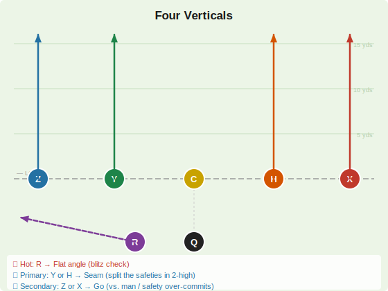
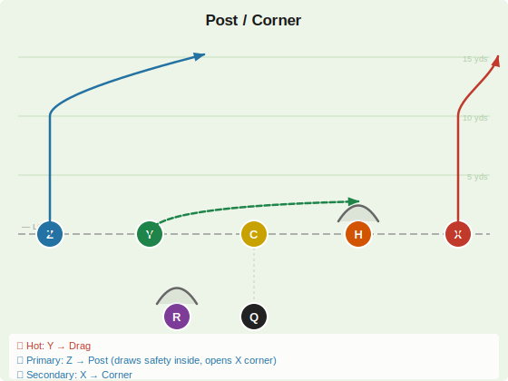
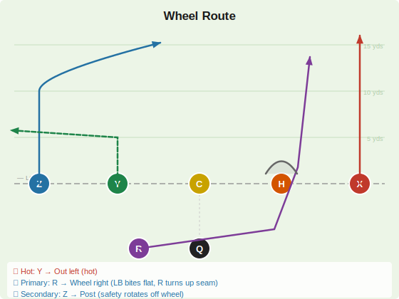

# Deep Shots

Vertical concepts (12+ yards). R blocks on every play. H blocks unless otherwise noted. Only call these when pass protection is set — the defense can rush from the 1-yard line.

---

## Four Verticals

| Player | Route | Depth | Notes |
|--------|-------|-------|-------|
| X | Go / Vertical | 15+ yds | Outside stem, push the CB deep |
| Z | Go / Vertical | 15+ yds | Outside stem, push the CB deep |
| Y | Inside Seam | 15+ yds | Split the safeties down the middle — primary vs. 2-high |
| H | Inside Seam | 15+ yds | Second inside seam right — stresses both safeties |
| R | **Flat angle** 🔥 | 2–3 yds | Angle route out of backfield — blitz check hot read |

**QB Reads**
- 🔥 **Hot:** R → Flat angle (dump off vs. blitz)
- 🎯 **Primary:** Y or H → Seam (split the two safeties; throw to whichever one the defense can't reach)
- ↩️ **Secondary:** Z or X → Go (vs. man coverage or when a safety over-commits to a seam)

> **Notes:** True four verticals with all receivers running routes. Pre-snap, identify the coverage. vs. Cover 2: Y and H seams split the two safeties — one will be open. vs. Cover 1 (single high): pick a favorable one-on-one on the outside (Z or X). R's flat is the blitz safety valve only — don't check down unless forced.

---

## Post / Corner

| Player | Route | Depth | Notes |
|--------|-------|-------|-------|
| X | Corner | 12–15 yds | Stem vertical, break outside to the corner |
| Z | Post | 10–12 yds | Stem vertical, break inside toward the middle |
| Y | **Drag** 🔥 | 3–4 yds | Shallow cross — hot read |
| H | Block | — | Pass protector |
| R | Block | — | Pass protector |

**QB Reads**
- 🔥 **Hot:** Y → Drag
- 🎯 **Primary:** Z → Post (draws the safety inside, opens the corner route)
- ↩️ **Secondary:** X → Corner (if the safety crashes on Z's post, the corner is wide open)

> **Notes:** Classic combination — Z's post holds the safety in the middle, creating a one-on-one for X's corner. Read the safety: if he stays deep-middle, throw Z's post into the window; if he rotates toward Z, throw the corner to X behind him. Needs H + R blocking for the 7-step drop.

---

## Wheel Route

| Player | Route | Depth | Notes |
|--------|-------|-------|-------|
| X | Go | 15+ yds | Vertical clear-out right — holds the CB and safety deep |
| Z | Post | 10–12 yds | Stem vertical, break inside — draws the left safety |
| Y | **Out** 🔥 | 4–5 yds | Quick out left — hot read if blitz comes |
| H | Block | — | Protects right side of the QB |
| R | Wheel | 10–15 yds | Flat release right out of backfield, then turn upfield along right hash |

**QB Reads**
- 🔥 **Hot:** Y → Out left (immediate throw if blitz)
- 🎯 **Primary:** R → Wheel right (LB follows the flat release, R turns up behind him — zone killer)
- ↩️ **Secondary:** Z → Post (if the safety rotates toward the wheel, the post opens)

> **Notes:** The wheel route is deadly vs. zone coverage. R initially releases flat to the right out of the backfield, drawing the linebacker to follow. When R turns upfield along the right hash, the LB is out of position and the seam opens up. X's go pins the right CB deep; Z's post holds the left safety inside — the wheel attacks the void between them. H provides critical protection on the right side for this longer-developing concept. Call vs. zone only — man coverage can follow the wheel more easily.
