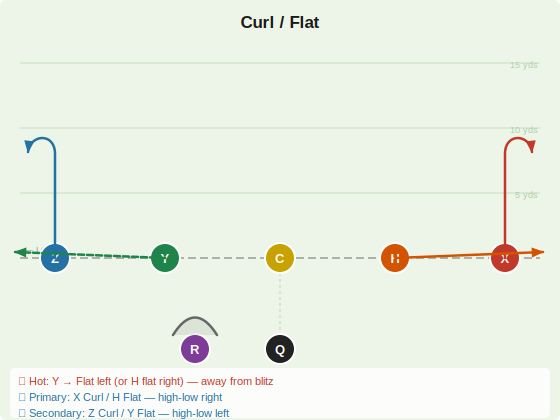
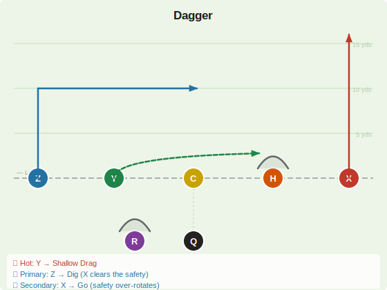
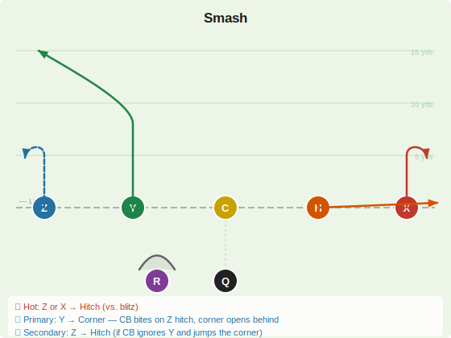

# Intermediate

Developing concepts (6–12 yards) that require a 5-step drop. R blocks on every play. H can block or route depending on the call.

---

## Curl / Flat

| Player | Route | Depth | Notes |
|--------|-------|-------|-------|
| X | Curl | 8–10 yds | Run vertical, break back toward QB |
| Z | Curl | 8–10 yds | Run vertical, break back toward QB |
| Y | **Flat** 🔥 | 2–3 yds | Immediate flare to left flat — hot read |
| H | Flat | 2–3 yds | Immediate flare to right flat |
| R | Block | — | Protects QB |

**QB Reads**
- 🔥 **Hot:** Y → Flat left (or H → Flat right) — pick the side away from the blitz
- 🎯 **Primary:** X Curl / H Flat — high-low on the right (if H draws the linebacker, X curl is open; if linebacker sits on X, hit H flat)
- ↩️ **Secondary:** Z Curl / Y Flat — high-low on the left

> **Notes:** Classic high-low concept — read the linebacker. If he drops, hit the flat underneath. If he charges the flat, throw the curl over the top. R must pick up any blitz. Y holds the left flat as the hot check; H occupies the right flat zone.

---

## Dagger

| Player | Route | Depth | Notes |
|--------|-------|-------|-------|
| X | Go / Seam | 15+ yds | Vertical clear-out — holds the deep safety |
| Z | Dig / In | 10–12 yds | Upfield then sharp 90° inside cut — primary target |
| Y | **Shallow Drag** 🔥 | 3–4 yds | Quick drag across the middle — hot read |
| H | Block | — | Pass protector |
| R | Block | — | Pass protector |

**QB Reads**
- 🔥 **Hot:** Y → Shallow Cross (throw on 5th step if blitz shows)
- 🎯 **Primary:** Z → Dig (X's vertical clears the safety, Z cuts underneath)
- ↩️ **Secondary:** X → Go (if the safety over-rotates or single coverage)

> **Notes:** Needs two blockers (H + R) for the 5–7 step drop. X's job is to run off the deep safety — don't worry if he's not open. Z's dig should find the vacated window. The route combination "daggers" the coverage: one receiver deep, one cutting underneath.

---

## Smash

| Player | Route | Depth | Notes |
|--------|-------|-------|-------|
| X | Hitch | 4–5 yds | Right-side hitch — backside of the concept |
| Z | **Hitch** 🔥 | 4–5 yds | Left-side hitch — sits shallow to hold the CB |
| Y | Corner | 10–12 yds | Stem vertical ~8 yds, break outside to the left corner — primary |
| H | Flat | 2–3 yds | Quick release to right flat — occupies right zone defender |
| R | Block | — | Protects QB |

**QB Reads**
- 🔥 **Hot:** Z → Hitch (left) or X → Hitch (right) — immediate outlet vs. blitz
- 🎯 **Primary:** Y → Corner — the CB must honor Z's hitch, leaving the corner route open behind him
- ↩️ **Secondary:** Z → Hitch (if CB ignores Y and gives the underneath route)

> **Notes:** Classic Cover 2 killer. The "Smash" concept pairs a shallow hitch (Z, 5 yds) with a deep corner route (Y, 10-12 yds) on the same side. The outside CB cannot cover both — he either sits on Z's hitch (leaving Y's corner open deep) or drives on Y's corner stem (leaving Z's hitch open underneath). H's flat keeps the right zone defender from doubling Z. 5-step drop; H and R provide protection.
