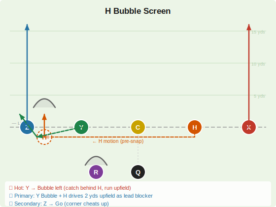
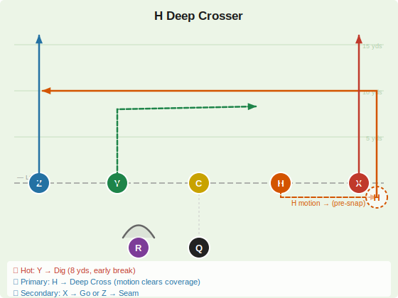
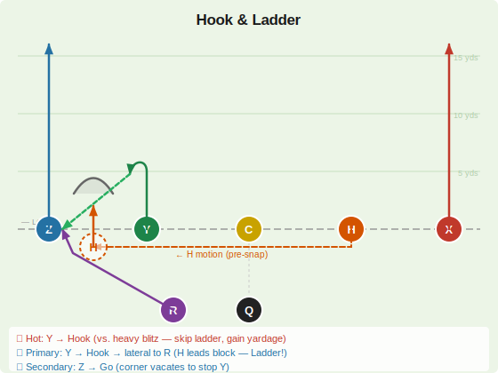

# Motion Plays

Pre-snap H motion concepts. Motion forces the defense to declare coverage early and can create numbers advantages or pull defenders out of position.

> **Reading motion:** Watch how the defense reacts to H's motion. If a defender follows H across the formation (man coverage), the backside is one-on-one. If defenders rotate zone, look for the hot spot the motion created.

---

## H Bubble Screen

**Motion:** H arcs from right slot backward and across to the outside-left of Y, becoming a lead blocker.

| Player | Route | Depth | Notes |
|--------|-------|-------|-------|
| X | Go | 15+ yds | Clears the corner — do not come back |
| Z | Go | 15+ yds | Backside clear |
| Y | Bubble | Behind LOS | Catches quick, turns upfield with H blocking |
| H | **Motion → Block** | — | Arcs right-to-left, becomes lead blocker outside Y |
| R | Block | — | Backside protection |

**QB Reads**
- 🔥 **Hot:** Y → Bubble (if the numbers defender follows H's motion, throw immediately at the snap)
- 🎯 **Primary:** Y Bubble + H as lead blocker
- ↩️ **Secondary:** X → Go (if the corner doesn't respect the bubble and cheats up)

> **Notes:** Pre-snap count the defenders outside the box on the right. If H's motion pulls a defender away, the bubble has numbers. The throw is immediate at the snap — don't hold it. X and Z's go routes hold the corners deep and keep them from crashing on Y.

---

## H Deep Crosser

**Motion:** H motions from right slot to the outside-right (outside of X), then releases on a deep crossing route back left across the field.

| Player | Route | Depth | Notes |
|--------|-------|-------|-------|
| X | Go | 15+ yds | Vertical clear-out right side |
| Z | Go / Seam | 15+ yds | Vertical — clears left side |
| Y | **Dig** 🔥 | 8–10 yds | Sharp inside cut right — hot read (earlier break than H) |
| H | Deep Cross | 12–15 yds | Arcs right then crosses left — primary |
| R | Block | — | Protects QB |

**QB Reads**
- 🔥 **Hot:** Y → Dig (8 yds, 5-step throw — early break before H's route develops)
- 🎯 **Primary:** H → Deep Cross (H's motion pulls man coverage across, he comes open behind it)
- ↩️ **Secondary:** X → Go or Z → Seam

> **Notes:** H's motion forces the defense to declare. In man coverage, H's motion often draws a linebacker to follow, creating a natural mismatch when H releases on the deep cross. In zone, the crossing route hits the vacated middle after the outside defenders follow H across. Y's dig at 8 yds is an earlier, shorter option — throw it if pressure comes early. Be patient — H's route develops late (10-12 yds).

---

## Hook & Ladder

**Motion:** H arcs from right slot backward and left to the outside of Y, then blocks for R after the lateral.

| Player | Route | Depth | Notes |
|--------|-------|-------|-------|
| X | Go | 15+ yds | Clears right CB and safety — do not come back |
| Z | Go | 15+ yds | Clears left CB — keeps safeties deep |
| Y | Hook | 4–5 yds | Stem upfield, hook back to face QB — catches the initial pass |
| H | **Motion → Block** | — | Arcs left to outside of Y, leads block for R after the lateral |
| R | Angle → Lateral | Behind LOS | Angles from backfield behind Y to receive the backward lateral |

**QB Reads**
- 🔥 **Hot:** Y → Hook (vs. heavy blitz — skip the ladder, just secure the catch and gain yardage)
- 🎯 **Primary:** Y → Hook → lateral to R (H leads the block, R turns upfield in space — the Ladder!)
- ↩️ **Secondary:** Z → Go (if the corner cheats up to take away Y's hook)

> **Notes:** A trick concept that exploits zone coverage. QB throws quickly to Y on the hook (5 yds). Y catches and immediately laterals backward to R, who comes from the backfield and is running behind the play — this is the "ladder" (the ball goes up to Y, then back down to R). H's motion brings a lead blocker to the left side for R. Z and X's go routes clear the safeties, giving R open space after the lateral. The lateral is only made if R is clearly in position — if not, Y secures the catch and gains yardage normally. The 🟢 green dashed arrow in the diagram marks the lateral.
