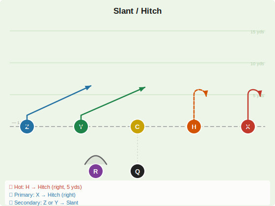
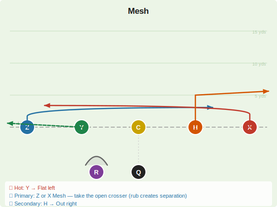
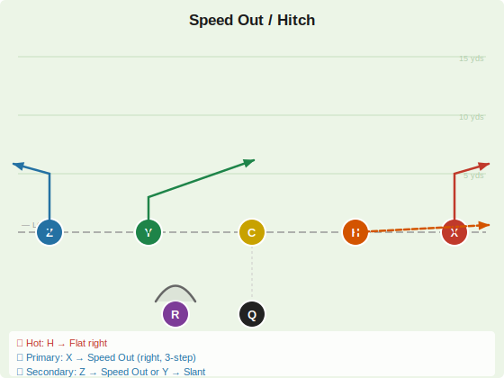

# Quick Game

Short-developing concepts (≤5 yards) designed to beat the blitz. Every play is a 3-step drop for the QB with an immediate hot read.

---

## Slant / Hitch

| Player | Route | Depth | Notes |
|--------|-------|-------|-------|
| X | Hitch | 4–5 yds | Vertical stem, stop and turn back to face QB — primary |
| Z | Slant | 4–5 yds | 2-step stem, break hard inside toward middle |
| Y | Slant | 4–5 yds | 2-step stem, break inside — mirrors Z |
| H | **Hitch** 🔥 | 4–5 yds | Vertical stem, stop and face QB — hot read right |
| R | Block | — | Protects QB |

**QB Reads**
- 🔥 **Hot:** H → Hitch (right side — throw before H finishes stem)
- 🎯 **Primary:** X → Hitch (right side, same concept deeper)
- ↩️ **Secondary:** Z or Y → Slant (left side crossers vs. bailing zone)

> **Notes:** Zone beater on two levels. The hitch sits underneath a bailing CB at 5 yds; the slant finds the hole inside the zone. Read CB leverage pre-snap: if CB is off the ball, hit the hitch; if CB is tight, the slant opens behind him. 3-step drop — ball out fast.

---

## Mesh

| Player | Route | Depth | Notes |
|--------|-------|-------|-------|
| X | Mesh (drag left) | 3–4 yds | Stem inside, drag cross tight to LOS — creates natural rub |
| Z | Mesh (drag right) | 3–4 yds | Stem inside, drag cross tight to LOS — creates natural rub |
| Y | **Flat** 🔥 | 2–3 yds | Immediate outside release left — hot read |
| H | Out | 5 yds | Stem vertical then break to right flat — secondary option |
| R | Block | — | Protects QB |

**QB Reads**
- 🔥 **Hot:** Y → Flat left
- 🎯 **Primary:** Z or X → Mesh (take whichever crosser is open — the rub creates separation)
- ↩️ **Secondary:** H → Out right

> **Notes:** Pre-snap, identify man vs. zone. In man coverage the drag routes create natural picks/rubs. In zone, find the window in the middle — one of the two crossers will sit open. Z crosses at 3 yds, X crosses at 3 yds, they meet at the mesh point around the center — throw to the open man. Don't force it.

---

## Speed Out / Hitch

| Player | Route | Depth | Notes |
|--------|-------|-------|-------|
| X | Speed Out | 3–5 yds | Stem inside 1 step, then break sharp outside |
| Z | Speed Out | 3–5 yds | Stem inside 1 step, then break sharp outside |
| Y | Slant | 3–4 yds | Inside release, quick alternative |
| H | **Flat** 🔥 | 2–3 yds | Immediate outside release right — hot read |
| R | Block | — | Protects QB |

**QB Reads**
- 🔥 **Hot:** H → Flat right
- 🎯 **Primary:** X → Speed Out (right side, 3-step)
- ↩️ **Secondary:** Z → Speed Out or Y → Slant

> **Notes:** Throw before receivers finish their break — the ball should be in the air as they turn. Read CB leverage: outside-shade CB = throw the speed out; inside-shade CB = throw the slant (Y). If blitz shows, dump to H flat immediately.
